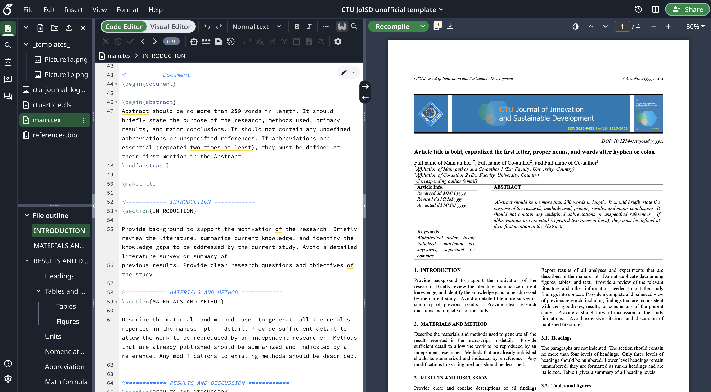

# CTU JoISD - Overleaf template

This is the unofficial [CTU Journal of Innovation and Sustainable Development (JoISD)](https://ctujs.ctu.edu.vn/index.php/ctujs/index) article template in Overleaf.

Đây là mẫu bản thảo không chính thức của [Tạp chí Khoa học của Đại học Cần Thơ, bản tiếng Anh](https://ctujs.ctu.edu.vn/index.php/ctujs/index).

> **Important:** You must use `lualatex` or `xelatex` to compile this project. Other compilers like `pdflatex` may not work correctly.

> **Quan trọng:** Bạn phải sử dụng `lualatex` hoặc `xelatex` để biên dịch dự án này. Các trình biên dịch khác như pdflatex có thể không hoạt động chính xác.

[Open in Overleaf](https://www.overleaf.com/read/grkqcrgjpwmw#958c10)

## 📄 Submission Workflow - Quy trình nộp bài

1. Compile and download the PDF - Biên dịch và tải xuống tệp PDF.
2. Convert the PDF to Word - Chuyển đổi tệp PDF sang Word.
3. Correct any formatting issues - Sửa các lỗi định dạng nếu có.

## Screenshot

